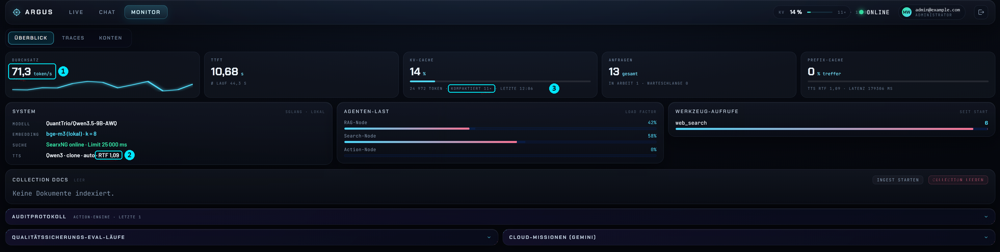
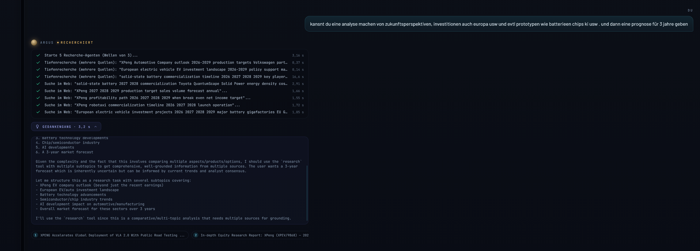
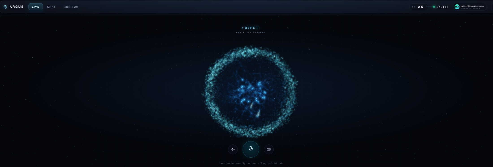
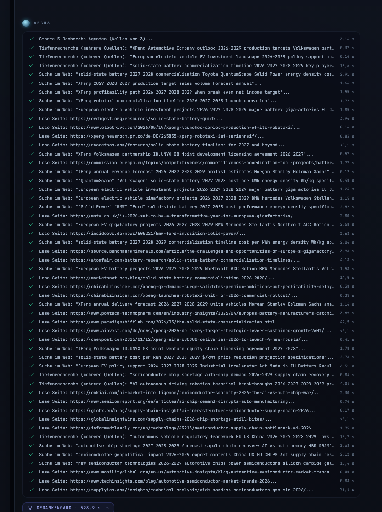
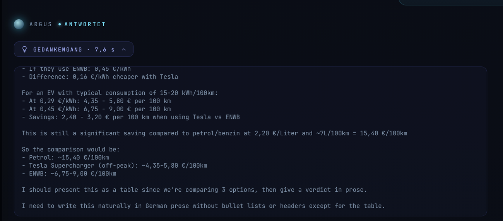
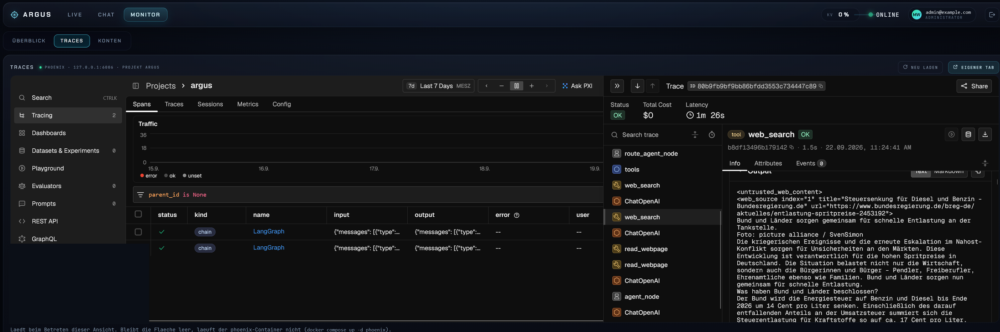

# Argus

*English · [Deutsch](README.de.md)*

A personal AI assistant that runs entirely on your own machine. The language model sits
on your GPU, your documents in your own database, web search goes through your own search
engine. No vendor watches, no subscription, nothing gets handed over — unless you
deliberately switch on the cloud stage, and then it is pseudonymised first.

Argus is not a chat window with search bolted on. It reads documents, researches the web,
computes in a sandbox, speaks and listens, and it **operates the Windows machine** it runs
on — through its own user account, over SSH, with a confirmation before every write.



*The Monitor view (administrators only). Three numbers say how the system is doing right
now: **①** 71.3 tokens per second on an RTX 5070 Ti. **②** Speech output at a real-time factor
of 1.09 — it speaks about as fast as the recording lasts, and it does so on the CPU, so the
GPU belongs to the language model. **③** Since start-up the message chain has been compacted
eleven times because the context filled up. That counter sits next to the KV usage on
purpose: 14 % looks relaxed, but only together with the number beside it can you tell whether
that headroom is real or was just cleared. Below: agent load, tool calls, audit log, eval runs
and cloud missions.*



*A research task in the chat: five research agents in waves, every search and every page
read with its timing, plus the collapsible reasoning and numbered sources.*



*The Live view: hold Space to speak, Esc cancels. The orb shows the state — ready,
listening, thinking, researching, speaking.*

<details>
<summary>Full trace of the same research (50+ steps) and the expanded reasoning</summary>




</details>

---

## What it does

**Talk and listen.** Text chat and a voice mode (hold Space to speak). Speech output can
use a cloned reference voice; recognition runs locally on faster-whisper. None of it leaves
the machine.

**Read and judge your own paperwork.** Contracts, invoices, insurance policies, payslips —
PDF, DOCX, EPUB, HTML, plain text. Two separate paths: **read** once (lands only in the
current conversation) or **index** permanently (Qdrant, searchable later). Files are
dragged into the chat.

**Research.** Web search through a self-hosted SearxNG instance, with results read as full
pages rather than snippets. For broader questions, deep research reads several sources in
parallel.

**Operate the computer.** Restart services, check disk space, read event logs, install
Windows updates, run PowerShell. Read-only commands run immediately, writes only after
confirmation, deletions one at a time with a second prompt. The whole thing can be switched
off if you only want the assistant.

**Compute and run code.** Symbolic maths and Python in an isolated sandbox with no network.

**Work out distances.** Driving distance and travel time between two addresses via
OpenStreetMap — one way and round trip, so a commute adds up in a single step. No key
needed; heavy users point `Setup2.py` at their own Nominatim/OSRM.

**Look at images.** Optional — the model is multimodal, but the vision path costs VRAM, so
it sits behind a switch (see [Enabling vision](#enabling-vision)).

**Cloud missions.** For tasks beyond the local model there is an optional stage on Gemini:
a planner breaks the goal down, workers research, a reviewer checks. Runs in the
background, the result is delivered to you. Everything that goes out passes a PII detector
first, which blocks when in doubt.

**Remember.** A curated long-term memory per user plus daily notes the assistant draws on
itself.

**Telegram.** Optional access from anywhere, including voice messages, photos and the
confirmation cards for write actions.

---

## Who it is for

Anyone who wants a capable assistant without handing their paperwork to anyone. This is
not a tool for one trade — wherever documents are confidential or a machine needs
operating, there is work for it:

| Who | What Argus does there |
|---|---|
| Private life | compare insurance policies, check a lease, recompute payslips and tax assessments, understand medical letters |
| Trades (electrical, plumbing, construction) | make data sheets, standards and manufacturer docs searchable; check quotes and supplier terms; summarise test reports and site measurements |
| Engineering offices | standards and technical documentation as a knowledge base; unit-aware calculations in the sandbox; log files and measurement series evaluated |
| HR | employment contracts, references, works agreements, application files — data that must not leave the building |
| Law firms, medical practices, tax advisers | everything under confidentiality: read files, pull out deadlines and clauses, prepare letters |
| Purchasing, sales, administration | compare quotes, check supply contracts and terms, summarise tenders |
| IT and machine operation | services, updates, event logs, PowerShell — an assistant that is actually allowed to operate the box instead of only suggesting commands |
| Self-employed, clubs and associations | recompute the books, understand contracts and grant notices, research for applications |
| Learning and research | lecture notes and literature made searchable, deep research with sources — and the whole build as an open teaching piece: RAG, agent loop, tool calls, hardening |

It is not meant as a multi-user service for a company. It runs on **one** machine, for its
owner.

---

## Architecture

Ten containers, all bound to `127.0.0.1` only:

| Service | Role |
|---|---|
| `sglang` | language model on the GPU (Qwen3.5-9B, AWQ-quantised) |
| `rag-backend` | core: agent loop, tools, API, user interface |
| `qdrant` | vector store for documents |
| `postgres` | conversations (encrypted), accounts, metadata |
| `searxng` | your own search engine |
| `tts-service` | speech output (Qwen3-TTS on GGML, CPU), optionally with a cloned voice |
| `stt-service` | speech recognition (faster-whisper, CPU) |
| `calc-sandbox` | isolated Python execution, no network |
| `phoenix` | tracing: what the agent did, and when |
| `open-webui` | alternative front end |

The **setup scripts are the source**, not the generated code. `rag_backend/`,
`docker-compose.yml`, `alembic/` and the `.env` are produced by `Setup1-4.py`,
`Setup_Dashboard.py` and `setup_common.py`. A change made directly in a generated file
silently disappears on the next generator run. That is deliberate: what you back up and
hand on is five Python files and one PowerShell script; everything else is reproducible
from them.

---

## Measurements

Two acceptance runs, both against `QuantTrio/Qwen3.5-9B-AWQ` on an RTX 5070 Ti (16 GB):

| Suite | Scope | Result | Date |
|---|---|---|---|
| HumanEval (subset) | 20 of 164 tasks | 20/20 passed, 26 s total | 2026-07-31 |
| Own agent suite | 50 tasks | 50/50 passed, ⌀ 32 s per task | 2026-07-25 |

**Context, so the numbers do not promise more than they hold:** the HumanEval run uses a
subset of 20 tasks, not the full benchmark. The second suite is **home-made**, in the
style of GAIA but not GAIA — it contains categories that do not exist there (system
operation, sandbox, EU law, security checks), and part of the answers are graded by a
model rather than by exact match. It measures whether this assistant solves the tasks it
was built for. It is no use for comparison with published leaderboards.

Task distribution: 20 at level 1, 20 at level 2, 10 at level 3; covering web search,
multi-step reasoning, document search, unit-aware arithmetic, system operation and agent
planning.

---

## Requirements

**Operating system: Windows 11.** Not a preference, a design fact. Machine control talks
PowerShell to the Windows host over SSH, `setup_ssh.ps1` creates the user there, and the
containers mount Windows paths (`C:\Argus_Workspace`). The containers themselves would run
on Linux — but the generators, the paths and the host tools would need adapting. That is
untested.

**GPU.** Developed and measured on an RTX 5070 Ti with 16 GB (Blackwell). The model takes
about 13 GB, the rest is KV cache, i.e. context. The SGLang image is the CUDA 13 variant
(`Dockerfile.blackwell`); older generations (Ada, Ampere) need a different base image and
are untested. More VRAM converts directly into context and image handling, see
[Configuration](#configuration).

**RAM.** Developed on 64 GB. Speech output, speech recognition, embeddings and the reranker
deliberately run on the CPU so the GPU belongs to the language model. The memory limits of
those containers add up to roughly 26 GB (TTS 12, backend 8, STT 3, Phoenix 2, sandbox
0.5), plus SGLang itself. I would not attempt it below 32 GB.

**Disk.** Around 60 GB for images and model weights.

**Docker Desktop** with the WSL2 backend and GPU access (`nvidia-smi` must work inside the
WSL distribution).

**Python 3.12+ on the host**, only for the generators. Three packages:

```bash
pip install cryptography PyJWT python-dotenv
```

Everything else lives in the containers.

**Accounts and tokens.** A HuggingFace token is required (model downloads). Gemini key and
Telegram bot are optional — empty means off.

---

## Setup

As Administrator, in the project folder:

```powershell
.\setup_ssh.ps1
```

Creates the local user `argus`, installs OpenSSH, generates the Ed25519 key pair, sets the
firewall rule (port 22 only from the Docker networks) and the working directory.

Then enter the tokens (details under [Keys and secrets](#keys-and-secrets--api_tokens)):

- `API_Tokens/HF_TOKEN.txt` — required
- `API_Tokens/Gemini.txt`, `API_Tokens/telegram.txt` — optional, empty means off

Generators in this order (`Setup1.py` pulls in `Setup_Dashboard.py` automatically):

```bash
python Setup1.py && python Setup2.py && python Setup3.py && python Setup4.py
```

Build and start — the first run downloads the model weights, which takes a while:

```bash
docker compose up -d --build
```

Then create the first accounts. The **first** account becomes administrator in each case:

- http://127.0.0.1:7860/dashboard/ — Argus chat
- http://localhost:3000 — Open WebUI (its own account management)

On the first run of `Setup2.py` Argus writes its personality to
`C:\Argus_Workspace\identity\SOUL.md` — tone, rules, and how it addresses you. Enter your
name beforehand: either `"owner_name": "Your Name"` in `LLM_CONFIG` (`Setup2.py`) or, if you
pass your setup files on, as a line `OWNER_NAME=Your Name` in the `.env` — the generators
leave it in place. Empty means Argus addresses you without a name. The identity files are
meant to be edited and are read live; a generator run does not overwrite them.

---

## Configuration

All switches live in Python dicts inside the setup scripts, **not in the `.env`**. The
`.env` is generated from them and overwritten on the next run. The path is always the
same: change the value in the setup script, run the script, restart the affected
containers.

| Area | Where | Afterwards |
|---|---|---|
| Language model, context, vision, RAG, research | `Setup2.py` → `LLM_CONFIG` | `python Setup2.py`, then `docker compose up -d sglang rag-backend` |
| Machine control, SSH, approvals | `Setup3.py` → `ACTION_CONFIG` | `python Setup3.py`, then `docker compose up -d rag-backend` |
| Cloud missions (Gemini) | `Setup4.py` → `write_env_block("SETUP4", …)` | `python Setup4.py`, then `docker compose up -d rag-backend` |
| Voice, rate limits, registration, uploads, tracing | `Setup1.py` → `env` | `python Setup1.py`, then `docker compose up -d` |

The generator only writes a value that has changed; a run without changes is a plain
pass-through.

### Keys and secrets — `API_Tokens/`

The folder is excluded via `.gitignore` and restricted to your own user on the host.
Anything you enter there in plain text is replaced by `Setup1.py` on its next run with an
encrypted value (`ENC:…`, Fernet with `fernet_key.txt`). The containers get the files
mounted as `/run/secrets` and decrypt in-process.

| File | Created by | Required? | Purpose |
|---|---|---|---|
| `HF_TOKEN.txt` | you | yes | model downloads from HuggingFace |
| `Gemini.txt` | you | no | cloud missions and `cloud_ask`; empty = cloud stage off |
| `telegram.txt` | you | no | bot token and chat ID, two `KEY=VALUE` lines |
| `LANGSMITH_API_KEY.txt` | you | no | tracing to the LangSmith cloud instead of local Phoenix |
| `ssh_user.txt`, `ssh_key`, `ssh_key.pub`, `ssh_password.txt` | `setup_ssh.ps1` | — | the action engine's access to the host; the password is emptied once key auth is in place |
| `fernet_key.txt` | `Setup1.py` | — | the key behind everything encrypted: secrets, chat histories |
| `jwt_secret.txt`, `webui_secret_key.txt`, `service_token.txt` | `Setup1.py` | — | logins, Open WebUI coupling |
| `postgres_password.txt`, `sglang_api_key.txt`, `searxng_secret_key.txt`, `audit_hmac_key.txt` | `Setup1.py` | — | internal services, audit log signature |

`fernet_key.txt` is the master key. Lose it and histories and encrypted tokens become
unreadable; that is why `Setup1.py` stops hard on an invalid key instead of quietly
generating a new one.

### Setting up Telegram

1. Open `@BotFather` in Telegram, `/newbot`, pick a name. The token looks like
   `8123456789:AAF…`.
2. Message your new bot — anything, so that a chat exists.
3. Get your chat ID: open `https://api.telegram.org/bot<TOKEN>/getUpdates` in a browser;
   the JSON contains `"chat":{"id":123456789,…}`.
4. Fill in `API_Tokens/telegram.txt`:

   ```
   TELEGRAM_BOT_TOKEN=8123456789:AAF…
   TELEGRAM_CHAT_ID=123456789
   ```

5. `python Setup3.py` (validates and encrypts the values), then
   `docker compose up -d rag-backend`.

The bot serves **exactly this one chat ID**; everyone else is ignored. It understands
text, voice messages (transcribed; reply optionally as speech — `/voice` toggles) and
photos. The same channel carries the confirmation cards for write actions and the results
of cloud missions.

Without Telegram, approvals work in the Argus chat through a card in the conversation.
Only the Open WebUI path cannot show a card — there, Telegram remains mandatory for write
actions.

### Cloud stage (Gemini)

Create a key in [Google AI Studio](https://aistudio.google.com/), put it in
`API_Tokens/Gemini.txt`, run `python Setup4.py`, then `docker compose up -d rag-backend`.

What this enables: `cloud_ask` (a single question to the large model, for instance after
the local agent has failed a host task several times) and **missions** — planner,
workers, reviewer, with web search through your own SearxNG. Model chains, rate limits
(preset for the free tier: 8 requests per minute, 200 per day), number of rounds and
result size live in the `SETUP4` block of `Setup4.py`.

Before every outbound call the pseudonymisation runs: e-mail, IBAN, phone numbers and
dates of birth by pattern, free-form names by the local model acting as a named-entity
recogniser, replaced by placeholders such as `[PERSON_1]`. If that step fails, **nothing is
sent** (`CLOUD_REDACTION_FAIL_CLOSED`). To switch the stage off entirely: leave
`Gemini.txt` empty or set `CLOUD_AGENTS_ENABLED` to `false`.

### Switching off machine control

If you only want chat, documents and research: at the top of `Setup3.py`, set
`ACTION_ENGINE_ENABLED = "false"`, run `python Setup3.py`, then
`docker compose up -d rag-backend`. The host tools are then never registered, the backend
opens no SSH connection, and `setup_ssh.ps1` need not have run — the `argus` user is not
needed.

### Enabling vision

The model is multimodal, but the image encoder costs VRAM that otherwise belongs to the
context. That is why the path is off by default. Enable it in `Setup2.py`, `LLM_CONFIG`:

```python
"sglang_enable_multimodal": "true",
"max_images_per_request":   2,       # about 1600 tokens per image
```

Then `python Setup2.py` and `docker compose up -d sglang rag-backend`. After the first
start with vision, check the SGLang log for what is left of the KV pool:

```bash
docker compose logs sglang | grep max_total_num_tokens
```

If the value is well below the requested `sglang_kv_pool_tokens`, adjust the context
accordingly (next section). Images then come in by dragging them into the chat or as a
photo via Telegram; text inside images is treated as data, not as instructions.

### Increasing the context

Four values in `LLM_CONFIG` (`Setup2.py`) determine the window:

| Value | Meaning |
|---|---|
| `sglang_max_sequence_len` | upper bound SGLang is asked for (`--context-length`) |
| `sglang_kv_pool_tokens` | requested KV pool (`--max-total-tokens`) — **a request, not a promise** |
| `effective_context_tokens` | cap the agent sets itself; what binds is always the smaller of this and the actually measured pool |
| `sglang_mem_fraction_static` | the OOM knob: share of VRAM SGLang may take (0.90) |

At start-up SGLang takes the smaller of the request and what fits into VRAM, and writes
the result to its log as `max_total_num_tokens`. The agent queries that real value at
runtime and plans with it — which is why you can set the three token values generously
without breaking anything. With more VRAM (24 GB and up) it pays to raise all three to
40,000 or more and leave `mem_fraction` at 0.90. If SGLang dies with out-of-memory, lower
`mem_fraction` or shrink the request.

### Swapping the model

The swap is one entry in `LLM_CONFIG`, but three things decide whether it works:

```python
"model_name":            "QuantTrio/Qwen3.5-9B-AWQ",
"sglang_model_revision": "938f8e3ef86c9d1e9bec3705e149694c172592f1",
"sglang_quantization":   "",            # empty: detected from the model config
"sglang_dtype":          "float16",
"tool_call_parser":      "qwen3_coder",
"reasoning_parser":      "qwen3",
```

**Move the revision along.** SGLang loads with `--trust-remote-code`, so it executes Python
from the HuggingFace repository. Pinning to a commit is supply-chain protection and must
be set anew when the model changes:

```bash
curl -s https://huggingface.co/api/models/<repo> | python -c "import json,sys;print(json.load(sys.stdin)['sha'])"
```

**Pick the tool-call parser to match the model.** This is the part that breaks most often
on a swap. The agent only receives tool calls if SGLang understands the model's format:
Qwen3.5 emits its calls as XML in the `qwen3_coder` style, older Qwen and most models with
a Hermes template as JSON (`hermes` or `qwen`). With the wrong parser SGLang reports
`Failed to parse JSON part`, and the agent answers empty or never calls a tool. Do not
rely on `auto` — for Qwen3.5 it guesses wrong. The same goes for `reasoning_parser`: it
must match the model's thinking tags, otherwise the reasoning ends up in the answer.

**dtype and quantisation.** Qwen3.5 (GDN architecture) needs `float16` for the model and
its conv cache, otherwise the first forward pass crashes in the Triton kernel; another
model will not need that. AWQ is detected from the model config; GPTQ or FP8 go into
`sglang_quantization`. The model plus KV pool must fit into VRAM — the 13 GB of the 9B AWQ
are the ceiling on 16 GB.

Afterwards `python Setup2.py`, `docker compose up -d sglang rag-backend`, check the SGLang
log for `max_total_num_tokens` and run the test suite (see [Operations](#operations)). The
backend contains a small normaliser for doubly JSON-encoded tool arguments, as Qwen
sometimes produces them; other models have other quirks that only show up in use. Vision
and language (`SOUL.md` sets German and the informal "du") are properties of the model,
not of the system.

### Voice

Without a reference voice Argus speaks with one of the built-in voices (`QWEN_VOICE` in
`Setup1.py`: `vivian`, `serena`, `ryan`, `aiden`, `eric`, `dylan`, `uncle_fu`, `ono_anna`,
`sohee`). For your own voice a single recording is enough:

- `voice_ref/stimme.wav` — 10 to 20 seconds, one speaker, calm and without reverb; any WAV works, the sample rate is converted to 24 kHz on load
- `voice_ref/stimme.txt` — the spoken text, word for word

Then set `"QWEN_CLONE_REF_WAV": "/app/voice_ref/stimme.wav"` in `Setup1.py`, run
`python Setup1.py`, then `docker compose up -d tts-service`. The voice is loaded once at
start and used for every reply; if the file is missing, the service falls back to the
preset voice instead of dying. Keeping `QWEN_SEED` fixed stops the voice drifting from
sentence to sentence.

The repository ships **no** reference voice. Use your own, or one you hold the rights to —
cloning another person's voice without their consent is not acceptable, and film audio is
copyrighted on top.

### Further switches

In `Setup1.py`: rate limits per endpoint, self-registration (`DASHBOARD_ALLOW_REGISTER`,
new accounts are always `chat`), login lifetimes (`JWT_EXPIRE_DAYS`,
`DASHBOARD_SESSION_HOURS`), retention of uploaded files (`UPLOAD_RETENTION_HOURS`),
tracing locally in Phoenix or to the LangSmith cloud, the host folder for eval runs and
audit files (`ARGUS_EVALS_DIR`, default `C:\Argus_Workspace\Evals`). In `Setup2.py`: chunking, number of
sources read, sub-agent time limits, size of the memory excerpt. Also in `Setup1.py`: the
speech service's audio cache (`TTS_CACHE_MAX_ENTRIES`, `TTS_CACHE_MAX_MB`), which makes a
second read-aloud of the same text free. In `Setup3.py`: approval
wait time (`CONFIRMATION_TIMEOUT_SECONDS`), lifetime of a task approval
(`TASK_APPROVAL_TTL_SECONDS`), output caps of the host tools. Every value carries a
comment in the script saying what it does.

---

## Usage

| Interface | Address |
|---|---|
| Argus chat | http://127.0.0.1:7860/dashboard/ |
| Open WebUI | http://localhost:3000 |
| Tracing | http://127.0.0.1:6006 |
| Telegram | if configured |

The Argus chat has three views: **Live** (voice mode, hold Space to speak, Esc cancels),
**Chat** (history; files are dragged in) and **Monitor** (administrators only: overview,
tracing, logs, accounts, collection).

Two roles. `admin` may do everything, `chat` may only talk and write. Self-registered
users always get `chat`.

Capabilities are invoked in plain language, not through commands:

| Intent | Example |
|---|---|
| Check paperwork | drag the file into the chat, then "is this contract okay?" |
| Research | "research the current state of …" |
| Windows action | "how much space is left on C:?", "restart the Spooler service" |
| Index permanently | "ingest the file C:\Users\…\report.pdf" |
| Cloud mission | "create a mission: compare … and summarise" |

Files dragged into the chat land in `C:\Argus_Workspace\Uploads` and are removed
automatically after 24 hours (`UPLOAD_RETENTION_HOURS`, `0` disables it). Whatever should
stay findable belongs in the knowledge base via indexing.

---

## Operations

| Purpose | Command |
|---|---|
| Rebuild after a code/setup change | `docker compose up -d --build` |
| Re-read configuration only | `docker compose up -d` |
| Follow the log | `docker compose logs -f rag-backend` |
| Stop | `docker compose down` |
| Full reset — **deletes database and Qdrant** | `docker compose down -v` |
| Tests | `docker compose run --rm --no-deps -v ${PWD}/rag_backend/tests:/app/rag_backend/tests rag-backend python -m pytest rag_backend/tests -q` |

Index documents in bulk: put files into `documents_to_ingest/`, then

```bash
docker compose exec rag-backend python -m rag_backend.ingest
```

After any change, always run the generators in their order first, then `docker compose`.
Never the other way round.

Back up: the setup files, `API_Tokens/` (contains the private SSH key and the Fernet key),
`assets/` (fonts, binary) and — if you use your own voice — `voice_ref/`. The two folders
holding secrets belong in no repository.

---

## Security

The assistant is allowed to operate the machine. That is the point where a system like
this becomes dangerous, so here is an honest account of what the hardening does and what
it does not.

### The model gets nothing past the gate

Every PowerShell script the agent wants to run is classified before execution — on the
text after comments, string literals, escapes and variables have been stripped, so that
nothing can hide behind them:

| Level | Examples | What happens |
|---|---|---|
| **READ** | `Get-Process`, `Get-Service`, `Test-Path`, `docker ps` | runs immediately |
| **WRITE** | `Set-*`, `New-*`, `Copy-Item`, redirections `>`, assignments, unknown cmdlets | confirm once per task; the approval covers the further steps of the same task for 30 minutes |
| **DESTRUCTIVE** | `Remove-*`, `del`, `.Delete()`, `Invoke-Expression`, `& $variable`, `Add-Type`, `New-Object` | confirm every single time, never through a task approval |
| **BLOCKED** | `Format-Volume`, `Stop-Computer`, `Set-ExecutionPolicy`, access to `API_Tokens`, `.ssh`, `.pem`, `.kdbx`, `.env` | never executed, not even with confirmation |

On top of that, a **veto against native binaries** that applies to every level: `cmd`,
`powershell`, `pwsh`, `reg`, `sc`, `schtasks`, `certutil` and any path to `.exe`/`.bat`/`.ps1`
are rejected, because they could escape the cmdlet-based check. Reading file **contents**
outside `C:\Argus_Workspace` (`Get-Content`, `Select-String`, `Import-Csv`) needs a
confirmation — listing and system state do not. The gate is **fail-closed**: whatever it
cannot clearly recognise as read-only counts as a write.

A rejection ends the task. The approval dialog expires after 120 seconds, and a rejection
is followed by a 30-second lock against nagging.

### Access to the host is narrow

- A dedicated local user `argus`. It **is a member of Administrators** — installing
  updates and restarting services does not work without — but it is a separate account
  with its own key, and everything it does goes through the gate and the audit log.
- SSH with an Ed25519 key only; the firewall rule admits port 22 only from the Docker
  networks. The host key is pinned on first connect (TOFU).
- Every session switches PowerShell into Constrained Language Mode. Without WDAC that is
  defence in depth, not a boundary — the boundary is the gate plus confirmation.
- The agent's file tools (`fs_*`) see only `C:\Argus_Workspace`.

### Foreign text is data, not instructions

Web pages, documents read, search results, text in images and tool outputs are framed as
data and HTML-escaped before they enter the context. In deep research a second model call
screens every source for hidden instructions (`web_injection_guard`). Identical tool calls
are deduplicated, and after six consecutive failures the agent stops and reports instead
of trying on.

This does not make the model immune. It bounds what a manipulated model can do: list
directories and query system state without asking — for file contents outside the
workspace and for anything that writes, it has to ask.



*Verifiable rather than claimed: the tracing view in the Monitor shows every step of a turn
and the raw tool output — here the web page that was read, visibly wrapped as
`<untrusted_web_content>`. That wrapper is what tells the model the text is data, not an
instruction.*

### Only pseudonymised content goes out

Before every cloud call: structured PII by pattern, names by local named-entity
recognition, replaced by placeholders, translated back in the reply. If detection fails,
nothing is sent. A tripwire aborts hard if something like an IBAN or credentials is still
in the package.

### Network, secrets, audit

- All containers are bound to `127.0.0.1`. The Python sandbox has no network at all. Web
  reading rejects private and internal addresses (SSRF filter at DNS level).
- Logins with Argon2 hashes, short-lived tokens, rate limits per endpoint, CSRF check via
  Origin and a host-header check. Chat histories are stored encrypted in Postgres.
- Secrets sit encrypted in `API_Tokens/`, are mounted as `/run/secrets` and decrypted
  in-process. A log filter redacts the Telegram token should a library write it into an
  output after all.
- Container images are pinned by digest, the model to a revision.
- Every system action, every approval and every rejection lands in an HMAC-chained audit
  log that cannot be altered afterwards without notice.

### What this does not protect against

- **Whoever has the machine has everything.** `fernet_key.txt` sits on disk; anyone who
  can read it and `API_Tokens/` can decrypt every secret and every conversation.
- **Not a network service.** There is no TLS, no tenant isolation, only two roles. Opening
  the ports to a network is neither intended nor secured.
- **The gate is a text filter, not a sandbox.** It is built fail-closed and has a test
  suite covering the known bypasses, but it classifies PowerShell by pattern. Hence the
  confirmation — that is the actual boundary.
- **Pseudonymisation is best effort, not perfect.** Named-entity recognition misses names.
  If nothing may leave, leave `Gemini.txt` empty.
- **The model remains a model.** It can be wrong, misread documents and be talked into
  things. Whoever confirms something important should read the command in the card.

Please do not report vulnerabilities as public issues; see [SECURITY.md](SECURITY.md).

---

## Limitations

- One machine, one owner, Windows 11, NVIDIA. No multi-user installation, no Linux host,
  no AMD or Apple GPU.
- 16 GB of VRAM means a 9B model and roughly 20,000 tokens of context. Long documents are
  chunked and read through the index, not in one piece.
- Speech output and recognition run on the CPU — good enough for dialogue, not for long
  read-alouds.
- The measurements above come from a home-made suite. They show that the system solves
  its own tasks, nothing more.

---

## Third-party components and licences

Argus uses the following projects unmodified as container images or packages; only
`tts-server.cpp` is a patch on an upstream file and carries its notice.

| Component | Role | Licence |
|---|---|---|
| [SGLang](https://github.com/sgl-project/sglang) | model server | Apache-2.0 |
| [Qwen3.5-9B](https://huggingface.co/Qwen/Qwen3.5-9B) via [QuantTrio AWQ](https://huggingface.co/QuantTrio/Qwen3.5-9B-AWQ) | language model | Apache-2.0 |
| [Qwen3-TTS](https://huggingface.co/Serveurperso/Qwen3-TTS-GGUF) and [qwentts.cpp](https://github.com/ServeurpersoCom/qwentts.cpp) | speech output | Apache-2.0 / MIT |
| [faster-whisper](https://github.com/SYSTRAN/faster-whisper) | speech recognition | MIT |
| [BAAI bge-m3](https://huggingface.co/BAAI/bge-m3), bge-reranker-v2-m3 | embeddings, reranking | MIT |
| [Qdrant](https://github.com/qdrant/qdrant) | vector database | Apache-2.0 |
| [SearxNG](https://github.com/searxng/searxng) | search engine | AGPL-3.0 (unmodified image) |
| [Open WebUI](https://github.com/open-webui/open-webui) | second front end | own licence (unmodified image) |
| [Arize Phoenix](https://github.com/Arize-ai/phoenix) | tracing | Elastic License 2.0 (unmodified image) |
| LangChain / LangGraph, FastAPI, PostgreSQL, paramiko | backend | MIT / MIT / PostgreSQL / LGPL |
| Barlow, Chakra Petch, JetBrains Mono | UI fonts | SIL OFL (`assets/fonts/`) |

The setup downloads the model weights with your HuggingFace token; the models' licence
terms apply to you.

## Changelog

What changed in each release: [CHANGELOG.md](CHANGELOG.md).

## Licence

See [LICENSE](LICENSE).
